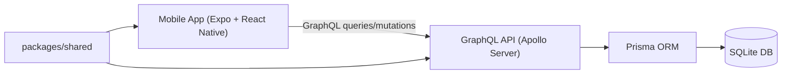
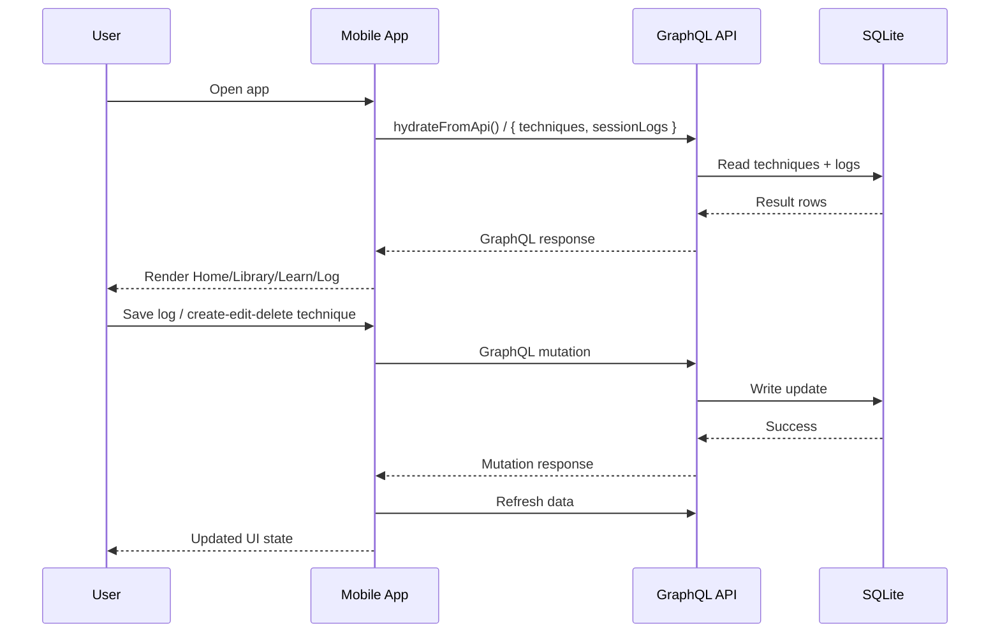
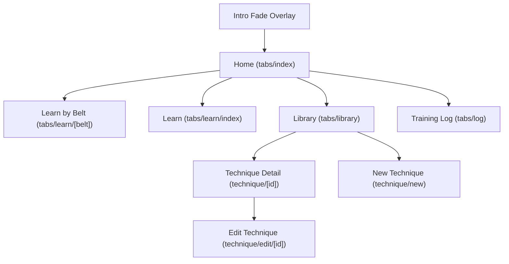
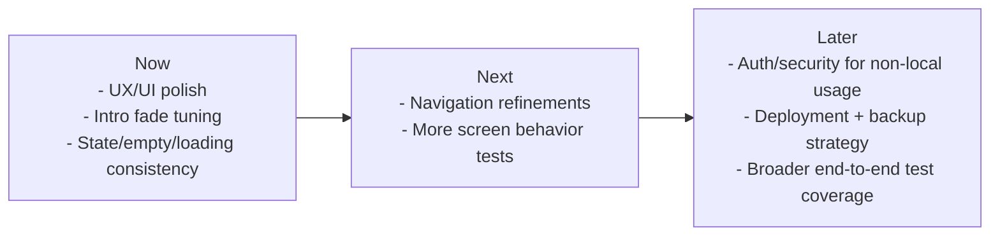

# RollTrack

RollTrack is a training companion for Brazilian Jiu-Jitsu currently in active development.  
The app build is ongoing as we iterate on UX and core training workflows.

## What The App Does

- Create, update, and delete techniques
- Log training sessions with notes and practiced techniques
- Track practice count and last-practiced date for techniques
- Filter and browse by belt guideline
- Use a clean mobile-first UI with short intro fade on app load

## Future Plans

Planned next focus areas discussed during development:

- UX/UI polish pass across all screens
  - tighter spacing rhythm
  - stronger hierarchy for CTAs
  - improved transitions and interaction feedback
- Continue refining startup intro/fade experience
  - potential first-run-only behavior
  - optional skip interaction
- Expanded state coverage
  - richer empty/loading/error/success feedback on every screen
- Navigation polish
  - consistent back behavior and context-aware headers
- Additional test coverage
  - more screen behavior tests and end-to-end API flow tests

## Tech Stack

### Frontend (`mobile/`)
- Expo + React Native + Expo Router
- TypeScript
- Zustand (state)
- NativeWind + Tailwind CSS (styling)
- Jest + `@testing-library/react-native` (tests)

### Backend (`server/`)
- Node.js + TypeScript
- Apollo Server (GraphQL)
- Prisma ORM
- SQLite
- Vitest (tests)

### Shared (`packages/shared/`)
- Domain types and shared utilities used by both mobile and server

## System Diagrams

### Architecture Overview



### Runtime Data Flow



### Navigation Map



### Roadmap Snapshot



## Monorepo Structure

| Path | Purpose |
|------|---------|
| `mobile/` | Expo app |
| `server/` | GraphQL API |
| `packages/shared/` | Shared types + utils |

## Quick Start

From the repo root:

```bash
npm install
```

Always install from the repo root so workspace dependencies resolve correctly.

## Environment Setup

Create `mobile/.env` from `mobile/.env.example`:

```bash
EXPO_PUBLIC_GRAPHQL_URL=http://127.0.0.1:4000
```

Tips:
- iOS Simulator: `127.0.0.1` or `localhost`
- Android emulator: `http://10.0.2.2:4000`
- Physical device: your machine LAN IP (e.g. `http://192.168.x.x:4000`)

## How To Run

### Run Frontend + Backend Together

```bash
npm run dev
```

This starts:
- mobile app (`@rolltrack/mobile`)
- server API (`@rolltrack/server`)

### Run Separately

Frontend only:
```bash
npm start
```

Frontend only (clear metro cache):
```bash
npm run start:clear
```

Backend only:
```bash
npm run server
```

Server first-time setup:
```bash
cd server && cp .env.example .env && npm run prisma:migrate && npx prisma db seed
```

## Data Source

- The mobile app fetches data from the GraphQL API (`mobile/src/services/graphql.ts`)
- The API reads/writes SQLite via Prisma (`server/prisma/`)
- Mobile does not currently use local SQLite persistence for runtime data

## Useful Scripts

| Script | Purpose |
|--------|---------|
| `npm run dev` | Run mobile + server together |
| `npm start` / `npm run mobile` | Run mobile app |
| `npm run start:clear` | Run mobile with cleared cache |
| `npm run ios` / `npm run android` / `npm run web` | Platform-specific mobile run |
| `npm run server` | Run backend API |
| `npm run test:mobile` | Run mobile test suite |
| `npm run test:server` | Run server test suite |
| `npm run lint` | Run mobile linting |

## Testing

Mobile:
```bash
npm run test:mobile
```

Server:
```bash
npm run test:server
```

---

For backend query/mutation examples, see `server/README.md`.
