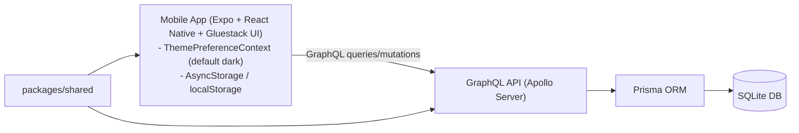
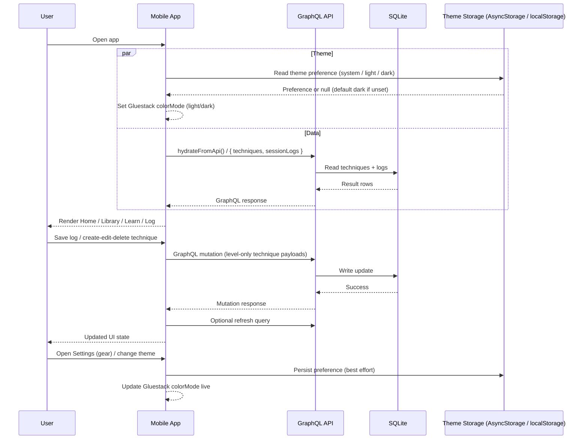
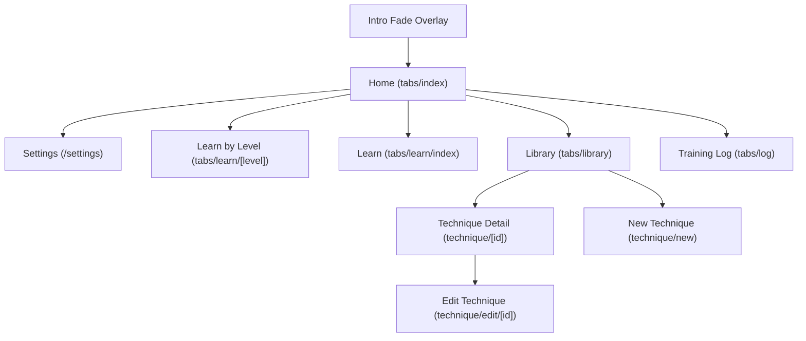
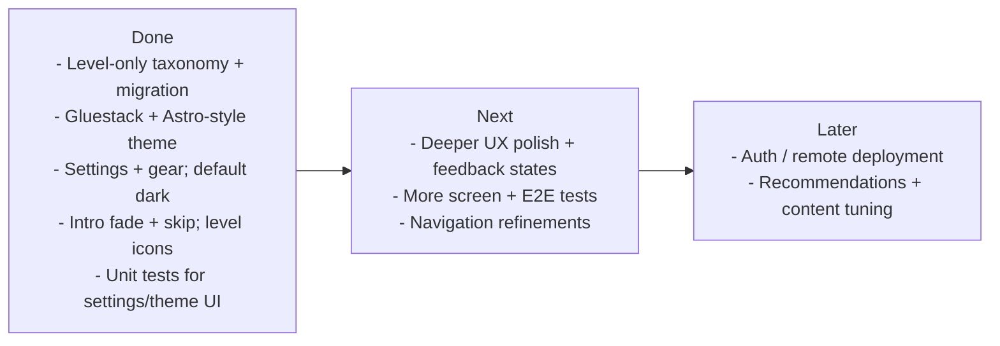
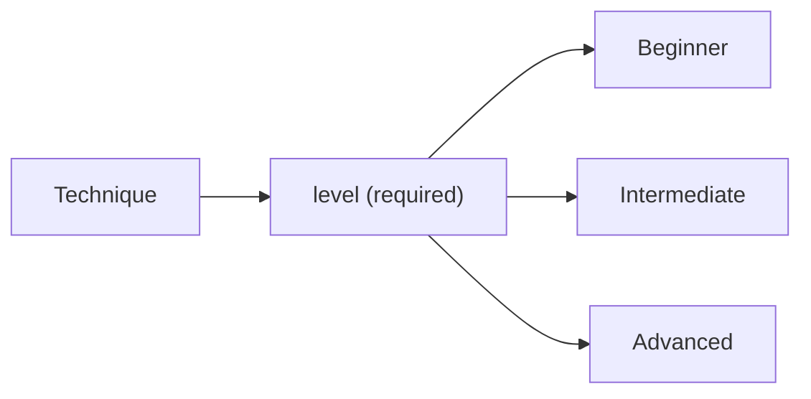

# RollTrack

RollTrack is a training companion for Brazilian Jiu-Jitsu currently in active development.  
The app build is ongoing as we iterate on UX and core training workflows.

## Recent Changes

- Removed belt-based taxonomy from active code paths.
- Standardized techniques on required `level` values: `Beginner`, `Intermediate`, `Advanced`.
- Updated GraphQL schema/resolvers and mobile data layer to level-only technique inputs/outputs.
- Applied Prisma migration to remove `Technique.beltGuideline` and keep `Technique.level` as required.
- Removed belt icon/color UI components and related tests.
- Navigation to level route (`tabs/learn/[level]`).
- **Mobile UI:** Gluestack UI across main flows (home, learn, library, log, technique CRUD); Tailwind/NativeWind kept in the toolchain (`global.css`) for compatibility.
- **Theme:** Astro.build-inspired palette (blue/purple accent, neutral surfaces); default appearance is **dark**; **Settings** screen (`/settings`) opened from a **gear** icon; Auto / Light / Dark persisted via AsyncStorage / `localStorage`.
- **Intro:** Full-screen splash with skip; hold + fade to app (~4s total) after data load; storage key `rolltrack-intro-seen`.
- **Home:** Distinct level icons (Beginner `school-outline`, Intermediate `layers-outline`, Advanced `trophy-outline`); level drill-in screen uses a single header title (no duplicate “techniques” title).
- **Tests:** Coverage for settings screen, settings gear, theme provider defaults, `ThemeAppearanceControl`, and `ScreenHeader` gear navigation.

## What The App Does

- Create, update, and delete techniques
- Log training sessions with notes and practiced techniques
- Track practice count and last-practiced date for techniques
- Filter and browse by technique level (`Beginner`, `Intermediate`, `Advanced`)
- Choose **Auto / Light / Dark** theme in **Settings** (gear icon on main screens)
- Short intro overlay on first launch (skippable); fade through to home after load

## Future Plans

**Still open**

- UX/UI polish
  - Gradient or richer primary CTAs (marketing-style) if desired
  - Motion / haptics on key actions
  - Further spacing and typography tuning
- State & feedback
  - Richer empty / loading / error / success patterns on every screen
  - Offline or retry UX for flaky API
- Navigation
  - Deeper linking and context-aware headers where helpful
- Testing
  - More screen-level tests; end-to-end flows against a running API
  - Optional Detox / Maestro-style E2E
- Product / data
  - Refine level tagging quality across techniques
  - Level-driven discovery and recommendations
- Platform
  - Auth and secure remote usage when moving beyond local dev
  - Deployment, backups, and environment strategy

## Tech Stack

### Frontend (`mobile/`)
- Expo + React Native + Expo Router
- TypeScript
- Zustand (state)
- Gluestack UI (`@gluestack-ui/themed` + extended `@gluestack-ui/config` in `mobile/src/theme/rolltrackGluestackConfig.ts`)
- Tailwind CSS + NativeWind (bundler pipeline; most UI is Gluestack tokens/components)
- Jest + `@testing-library/react-native` (tests)

### Backend (`server/`)
- Node.js + TypeScript
- Apollo Server (GraphQL)
- Prisma ORM
- SQLite
- Vitest (tests)

### Shared (`packages/shared/`)
- Domain types and shared utilities used by both mobile and server

## System Diagrams

### Architecture Overview


```mermaid
flowchart LR
  Mobile["Mobile App (Expo + React Native + Gluestack UI)\n- ThemePreferenceContext (default dark)\n- AsyncStorage / localStorage"] -->|GraphQL queries/mutations| API["GraphQL API (Apollo Server)"]
  API --> Prisma["Prisma ORM"]
  Prisma --> DB[("SQLite DB")]
  Shared["packages/shared"] --> Mobile
  Shared --> API
```

### Runtime Data Flow


```mermaid
sequenceDiagram
  participant User
  participant Mobile as Mobile App
  participant API as GraphQL API
  participant DB as SQLite
  participant Store as Theme Storage (AsyncStorage / localStorage)

  User->>Mobile: Open app
  par Theme
    Mobile->>Store: Read theme preference (system / light / dark)
    Store-->>Mobile: Preference or null (default dark if unset)
    Mobile-->>Mobile: Set Gluestack colorMode (light/dark)
  and Data
    Mobile->>API: hydrateFromApi() / { techniques, sessionLogs }
    API->>DB: Read techniques + logs
    DB-->>API: Result rows
    API-->>Mobile: GraphQL response
  end
  Mobile-->>User: Render Home / Library / Learn / Log

  User->>Mobile: Save log / create-edit-delete technique
  Mobile->>API: GraphQL mutation (level-only technique payloads)
  API->>DB: Write update
  DB-->>API: Success
  API-->>Mobile: Mutation response
  Mobile->>API: Optional refresh query
  Mobile-->>User: Updated UI state

  User->>Mobile: Open Settings (gear) / change theme
  Mobile->>Store: Persist preference (best effort)
  Mobile-->>Mobile: Update Gluestack colorMode live
```

### Navigation Map


```mermaid
flowchart TD
  Splash["Intro Fade Overlay"] --> Home["Home (tabs/index)"]
  Home --> Settings["Settings (/settings)"]
  Home --> LearnLevel["Learn by Level (tabs/learn/[level])"]
  Home --> LearnAll["Learn (tabs/learn/index)"]
  Home --> Library["Library (tabs/library)"]
  Home --> Log["Training Log (tabs/log)"]
  Library --> Detail["Technique Detail (technique/[id])"]
  Detail --> Edit["Edit Technique (technique/edit/[id])"]
  Library --> New["New Technique (technique/new)"]
```

### Roadmap Snapshot


```mermaid
flowchart LR
  Done["Done<br/>- Level-only taxonomy + migration<br/>- Gluestack + Astro-style theme<br/>- Settings + gear; default dark<br/>- Intro fade + skip; level icons<br/>- Unit tests for settings/theme UI"] --> Next["Next<br/>- Deeper UX polish + feedback states<br/>- More screen + E2E tests<br/>- Navigation refinements"] --> Later["Later<br/>- Auth / remote deployment<br/>- Recommendations + content tuning"]
```

### Technique Taxonomy (Current)


```mermaid
flowchart LR
  Technique["Technique"] --> Level["level (required)"]
  Level --> Beginner["Beginner"]
  Level --> Intermediate["Intermediate"]
  Level --> Advanced["Advanced"]
```

## Monorepo Structure

| Path | Purpose |
|------|---------|
| `mobile/` | Expo app |
| `server/` | GraphQL API |
| `packages/shared/` | Shared types + utils |

## Quick Start

From the repo root:

```bash
npm install
```

Always install from the repo root so workspace dependencies resolve correctly.

## Environment Setup

Create `mobile/.env` from `mobile/.env.example`:

```bash
EXPO_PUBLIC_GRAPHQL_URL=http://127.0.0.1:4000
```

Tips:
- iOS Simulator: `127.0.0.1` or `localhost`
- Android emulator: `http://10.0.2.2:4000`
- Physical device: your machine LAN IP (e.g. `http://192.168.x.x:4000`)

## How To Run

### Run Frontend + Backend Together

```bash
npm run dev
```

This starts:
- mobile app (`@rolltrack/mobile`)
- server API (`@rolltrack/server`)

### Run Separately

Frontend only:
```bash
npm start
```

Frontend only (clear metro cache):
```bash
npm run start:clear
```

Backend only:
```bash
npm run server
```

Server first-time setup:
```bash
cd server && cp .env.example .env && npm run prisma:migrate && npx prisma db seed
```

## Data Source

- The mobile app fetches data from the GraphQL API (`mobile/src/services/graphql.ts`)
- The API reads/writes SQLite via Prisma (`server/prisma/`)
- Mobile does not currently use local SQLite persistence for runtime data
- Technique taxonomy is level-only end-to-end (`level` required in shared types, GraphQL, and DB)

## Useful Scripts

| Script | Purpose |
|--------|---------|
| `npm run dev` | Run mobile + server together |
| `npm start` / `npm run mobile` | Run mobile app |
| `npm run start:clear` | Run mobile with cleared cache |
| `npm run ios` / `npm run android` / `npm run web` | Platform-specific mobile run |
| `npm run server` | Run backend API |
| `npm run test:mobile` | Run mobile test suite |
| `npm run test:server` | Run server test suite |
| `npm run lint` | Run mobile linting |

## Testing

Mobile:
```bash
npm run test:mobile
```

Server:
```bash
npm run test:server
```

---

For backend query/mutation examples, see `server/README.md`.
